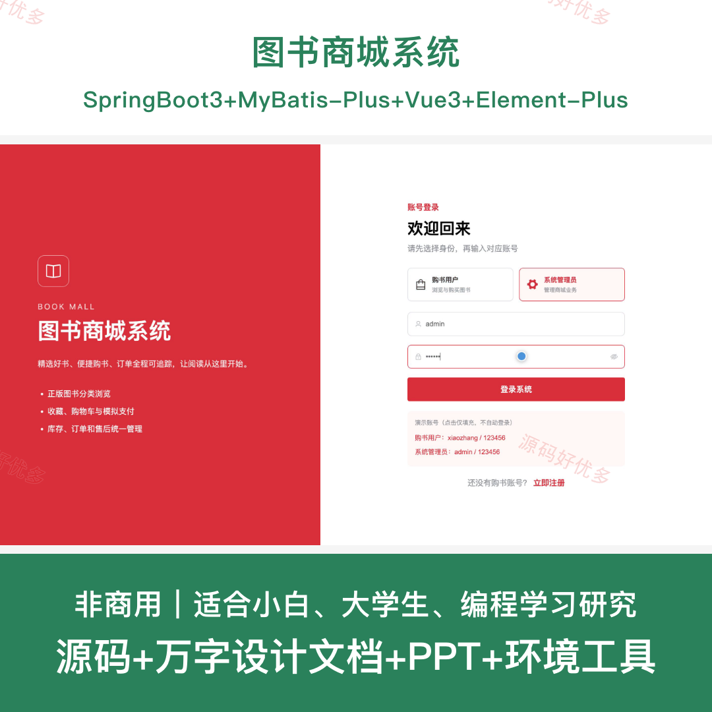
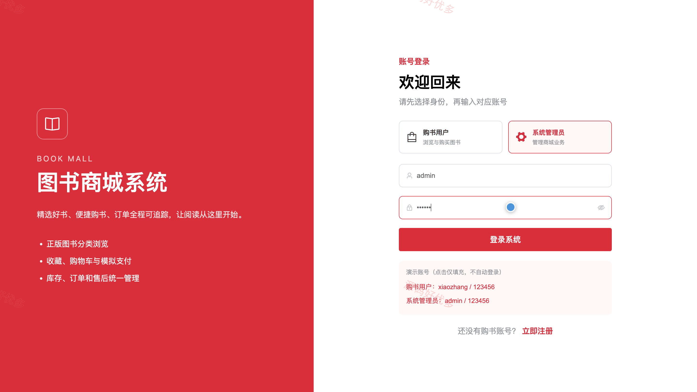
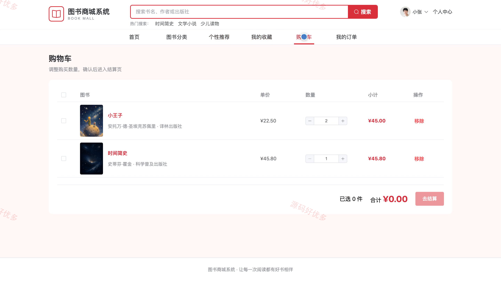
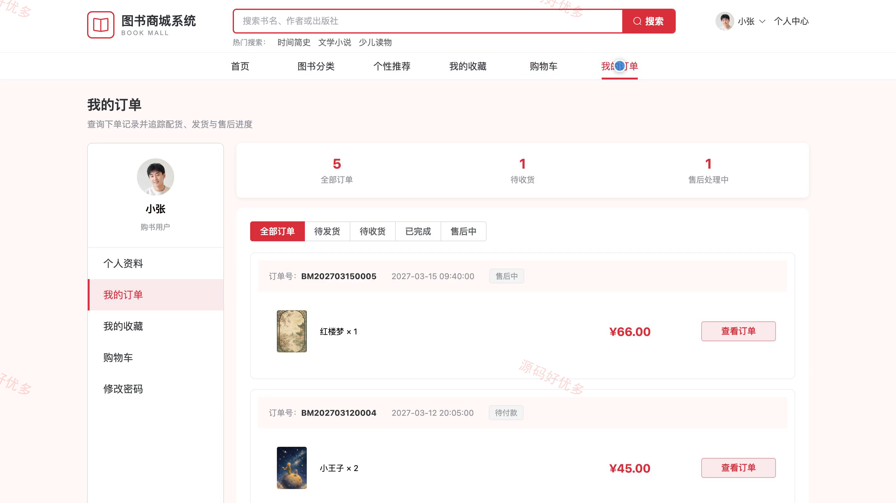
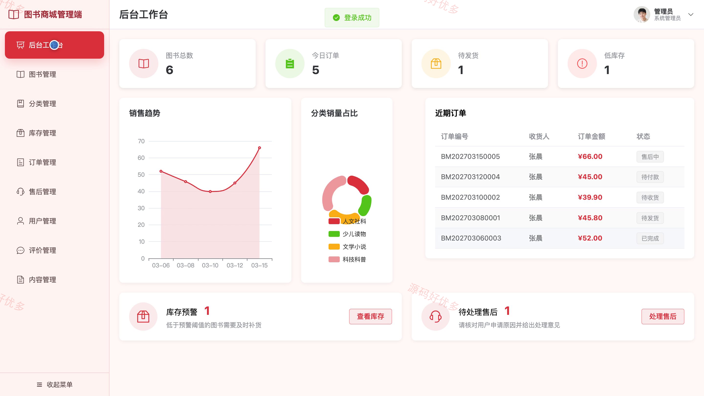
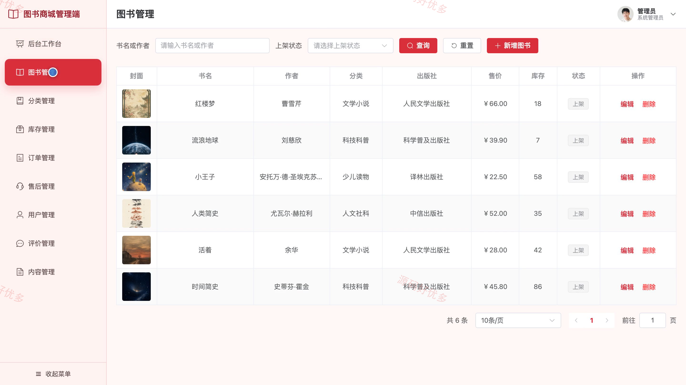
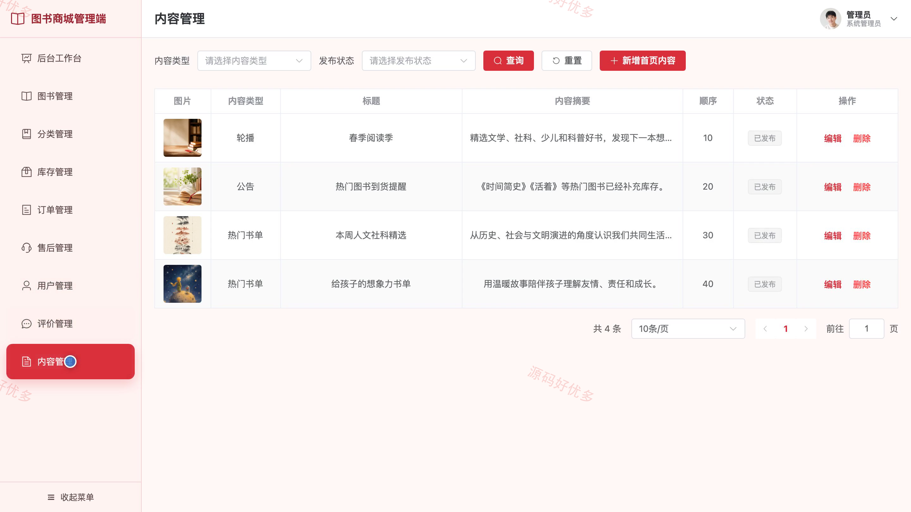

## 源码问题查看主页咨询

### 一、关键词
图书商城、网上书店、在线购书、图书零售、阅读服务

### 二、作品包含
源码+数据库+万字设计文档+PPT+全套环境和工具资源+本地部署教程

### 三、项目技术
前端技术： Html、Css、Js、Vue3.4、Element-Plus
后端技术：Java、SpringBoot3.2.0、MyBatis-Plus

### 四、运行环境（以下版本亲测，其他版本兼容性请自行测试）
开发工具：IDEA/eclipse + VSCODE

数据库：MySQL5.7+（共17张表）

数据库管理工具：Navicat10以上版本

环境配置软件： JDK17 + Maven3.6.3

前端Nodejs：20

浏览器：谷歌浏览器

### 五、项目介绍
项目编号：bs067A

图书商城系统面向购书用户与系统管理员，围绕图书浏览、收藏加购、订单结算、售后处理和库存运营等业务，支持用户完成在线购书流程，并支持管理员维护图书、分类、库存、订单、评价和首页内容。

角色：购书用户、系统管理员

购书用户功能：注册登录与个人资料维护、图书分类检索与详情浏览、个性推荐与图书收藏、购物车管理、收货地址维护与订单结算、订单查看与进度跟踪、确认收货、售后申请与图书评价。

系统管理员功能：商城经营数据统计、用户账号状态及密码管理、图书信息维护、图书分类维护、库存入库与变动记录管理、订单备货发货及物流管理、售后申请处理、图书评价审核与首页内容管理。

### 六、运行截图

